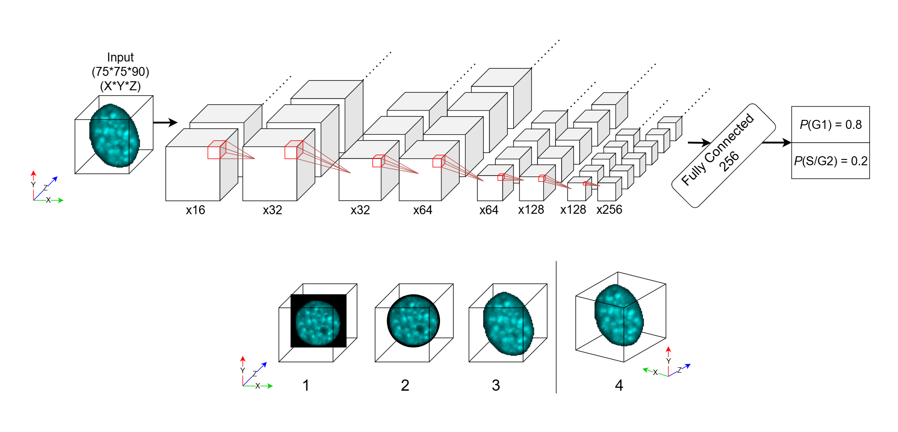

# CellCycleNet



## Installation

1. Make sure you have [conda](https://docs.conda.io/en/latest/miniconda.html) installed.

2. Install Mamba to facilitate installation of GPU-enabled dependencies:

```
$ conda install -n base -c conda-forge mamba
```

3. Clone this repo, then create the provided [conda environment](./environment.yml).

```
$ mamba env create -f environment.yml
$ conda activate ccn_dev_env
```

4. Activate the new conda environment and install `cellcyclenet`:

```
$ conda activate ccn_dev_env
$ cd CellCycleNet
$ pip install .
```

## Running the included examples

1. After installation, download `example_data.zip` from this URL: 

https://beliveau-shared.s3.us-east-2.amazonaws.com/cellcyclenet/data/example_data.zip

2. Try running the included examples on these example files using the included example notebooks:

	1. [Example #1](./notebooks/01_prediction_demo.ipynb): Predict cell cycle stage from segmented DAPI images
	2. [Example #2](./notebooks/02_fine_tune_training_demo.ipynb): Fine tune pre-trained model with additional training
